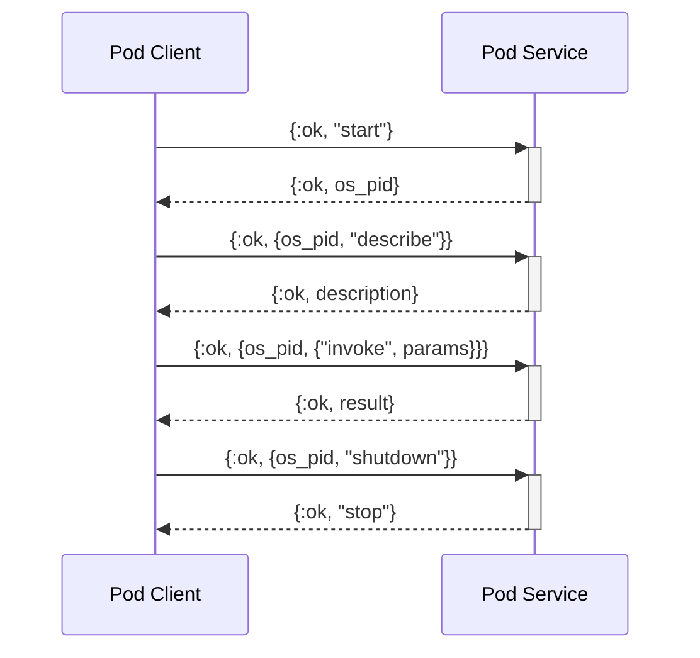

# Elixir Pods

_Elixir Pods_ is a way of communication between _Elixir_ and a service
implemented in any programming language (`pod`). This service must adhere to a simple protocol (`pod protocol`) that uses standard and battle tested tools (`stdin`, `stdout`, `bencode` and `json`) for it's implementation.

The main inspiration for this is [Babashka Pods](https://github.com/babashka/pods).

Basically is a command line tool that has an infinite bucle (`while true`)
that listen to commands in `stdin` and outputs the results in `stdout`.

Note how every component is fully customizable, so you can implement
those with your own tools and configurations.



## Implementing a Pod

You can implement the pods with any technology and a simple _Elixir_ wrapper to expose their API.

- `artifacts`: The directory where the external code executables will be stored.
- `pod.ex`: The main public api for the pod.
- `manifest.ex`: Some helper functions to have more information about the pod.

If you want to debug you can use standard tools such as stdin and stdout. In Unix systems you can access by using (1 stdout, 2 stderr).

```bash
  cat /proc/<pid>/fd/1
```

An _Elixir Pod_ must follow some simple rules:

- An infinite function (`while true`).
- Reads from `stdin` (in streaming mode).
- Writes to `stdout` (success and errors) and `stderr` (exceptions).
- Follows [Elixir Pods](POD_PROTOCOL.md) format.
- At least implements the `describe` and `invoke` operators.
- Encodes messages with [bencode](https://en.wikipedia.org/wiki/Bencode).
- Encodes payload with _JSON_.

## Installation

If [available in Hex](https://hex.pm/docs/publish), the package can be installed
by adding `pods` to your list of dependencies in `mix.exs`:

```elixir
def deps do
  [
    {:pods, "~> 1.0.0"}
  ]
end
```

Documentation can be generated with [ExDoc](https://github.com/elixir-lang/ex_doc)
and published on [HexDocs](https://hexdocs.pm). Once published, the docs can
be found at <https://hexdocs.pm/pods>.
